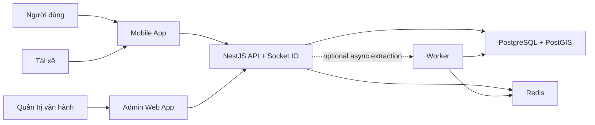
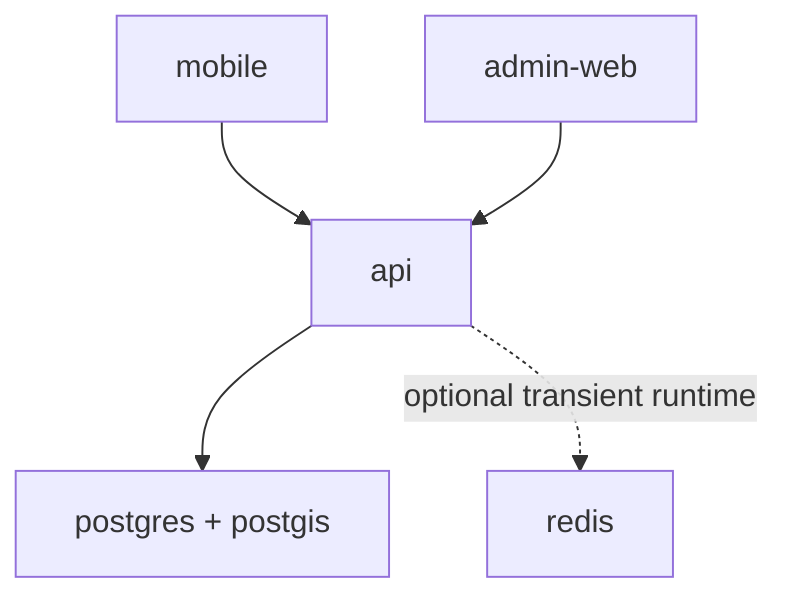
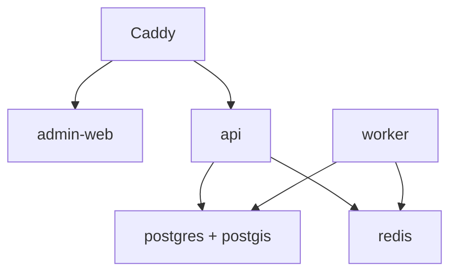
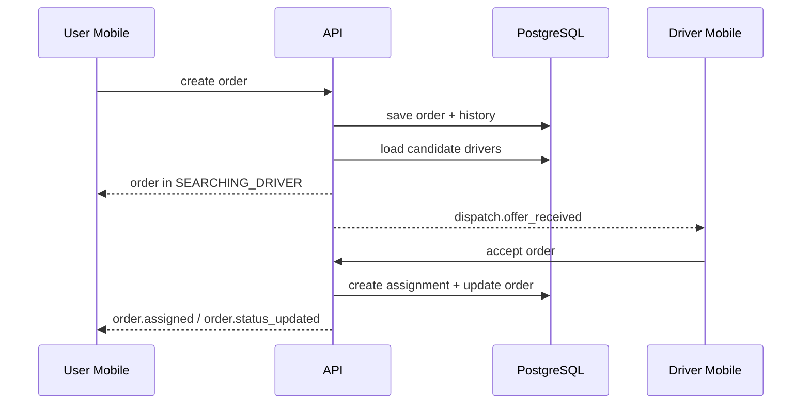
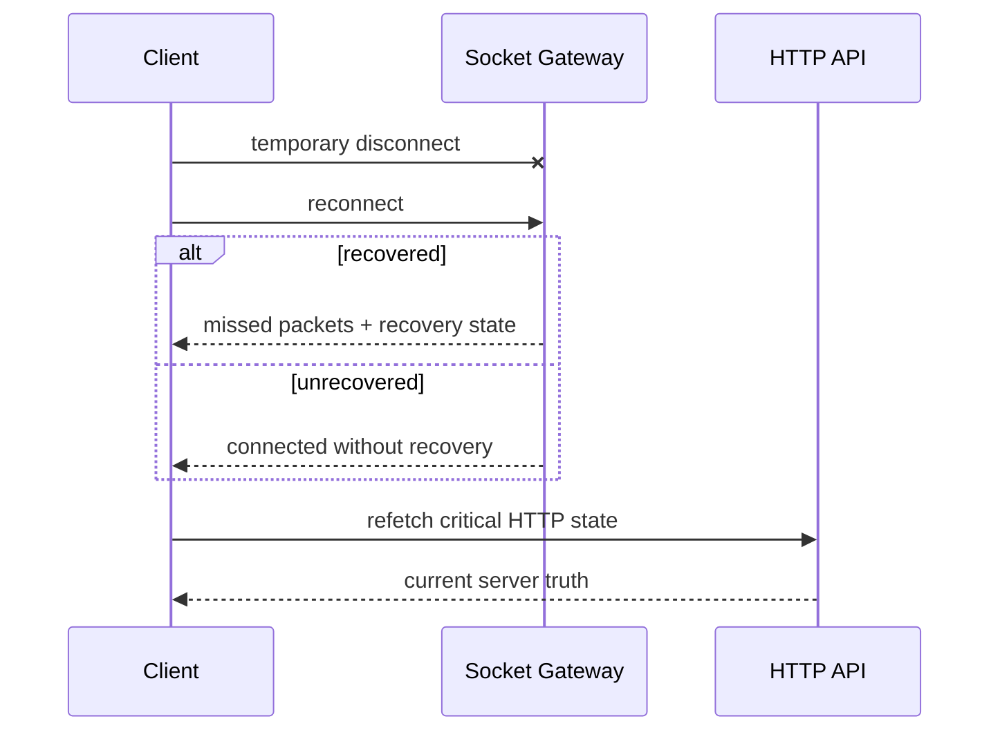

# 03. Kiến Trúc Hệ Thống

## Mục Đích

Mô tả cách các ứng dụng, data stores và lớp realtime phối hợp ở cấp độ toàn hệ thống, đồng thời làm rõ boundary giữa workspace architecture và runtime architecture.

## Trạng Thái

Baseline đã chốt cho `CV-ready MVP-1`, có mô tả rõ đường nâng cấp ở `MVP-3`.

## Hai Lớp Kiến Trúc Cần Phân Biệt

### 1. Workspace architecture

- repo là monorepo `Nx`
- `apps/*` là deployable runtimes
- `packages/*` là reusable code

### 2. Runtime architecture

- user, driver, admin đi qua mobile/web clients
- backend NestJS là trung tâm nghiệp vụ
- PostgreSQL là source of truth
- Redis hỗ trợ transient runtime và queue khi cần

## Ngữ Cảnh Hệ Thống

## Hai Mức Runtime Theo Phase

### `CV-ready MVP-1`

Đặc điểm:

- dispatch chạy trong API
- realtime đi thẳng từ API tới clients
- worker chưa bắt buộc
- local-first là baseline

### `MVP-3 / public demo`

Đặc điểm:

- dispatch retry, delayed work hoặc notifications có thể đi qua queue
- worker tách process để boundary runtime rõ hơn
- phù hợp khi cần public demo hoặc hardening

## Các Thành Phần Chạy Chính

### Mobile app

- một app cho cả `user mode` và `driver mode`
- user tạo quote, order, theo dõi đơn
- driver nhận offer, accept và cập nhật trạng thái

### Admin web

- quan sát order board
- điều tra order detail
- review driver applications ở phase sau

### API

- REST API
- auth/session
- OpenAPI
- realtime qua Socket.IO
- orchestration của quote, orders, dispatch, driver ops, onboarding, chat

### Worker

- không bắt buộc ở `MVP-1`
- dùng cho retry, delayed jobs, notifications, dispatch extraction

### PostgreSQL + PostGIS

- nguồn dữ liệu nghiệp vụ chính
- lưu state hiện tại, timeline và geospatial data cần thiết

### Redis

- không phải dependency bắt buộc của mọi biến thể `MVP-1`
- nếu dùng ở `MVP-1`, chỉ dùng cho transient runtime support có lý do rõ
- queue support khi worker được bật

## Luồng Nghiệp Vụ Chính

### Luồng giao hàng cốt lõi

- quote -> order -> dispatch -> assignment -> pickup -> delivery

### Luồng driver onboarding

- submit application -> admin review -> approve/reject -> refresh capability

### Luồng realtime

- order status updated
- dispatch offer received
- accept conflict
- admin board refresh
- chat message nếu feature được bật

## Sequence: Order Create Và Dispatch `MVP-1`

## Sequence: Reconnect Và Reconciliation

## Trust Boundaries Và Source Of Truth

### Source of truth

- order state: PostgreSQL
- capability state: PostgreSQL
- pricing version: PostgreSQL
- session state: backend + PostgreSQL

### Non-authoritative layers

- Socket.IO events
- client stores
- UI local state
- Redis transient state

## Cross-Cutting Constraints

- backend vẫn là một codebase NestJS duy nhất ở giai đoạn đầu
- mobile chỉ là một app với capability-based flows
- realtime không được thay thế API contract
- worker không được coi là prerequisite của `MVP-1`
- admin không được ôm business logic mà backend phải chịu trách nhiệm

## Những Gì Chưa Làm Ở Phase Đầu

- microservices
- event sourcing
- managed pub/sub riêng
- dedicated chat service
- multi-region runtime

## Kết Luận

Kiến trúc hệ thống phù hợp cho giai đoạn hiện tại là một delivery platform gọn nhưng nghiêm túc: monorepo `Nx`, backend monolith rõ module, một mobile app đa mode, một admin app cho ops, và một runtime ưu tiên local-first nhưng chừa chỗ rõ ràng cho hardening phase sau.
