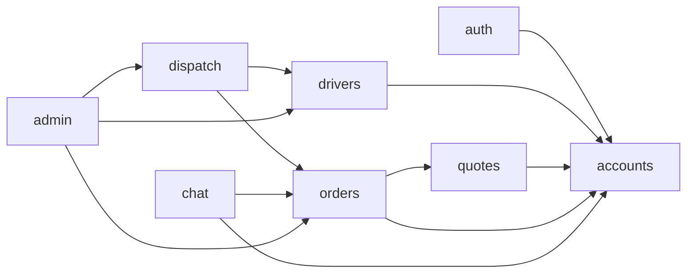
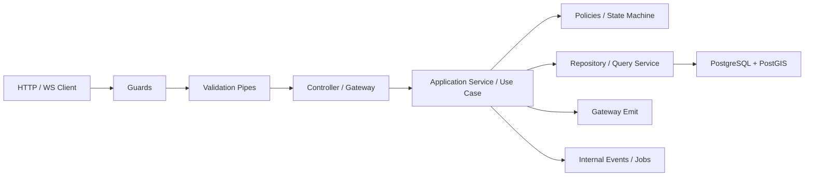

# 04. Kiến Trúc Backend

## Mục Đích

Xác định kiến trúc backend đủ chi tiết để có thể triển khai thật bằng NestJS mà không phải tự phát minh lại patterns, module boundaries, business rules và realtime behavior.

## Trạng Thái

Baseline đã chốt cho `CV-ready MVP-1`, có nêu rõ đường nâng cấp ở phase sau.

## Quan Điểm Cốt Lõi

- backend lấy `NestJS` làm trung tâm
- tổ chức theo feature-first modules
- mỗi module đi theo bốn lớp: `presentation`, `application`, `domain`, `infrastructure`
- Prisma là data-access baseline
- realtime là gateway hỗ trợ UX, không phải nguồn sự thật cuối cùng
- dispatch bắt đầu trong API, nhưng contract không được phụ thuộc chuyện có worker hay không

## Domain Catalog

| Module | Trách nhiệm chính | Không chịu trách nhiệm |
| --- | --- | --- |
| `auth` | login, refresh, logout, session lifecycle | capability rules nghiệp vụ |
| `accounts` | account profile và identity-level metadata | driver ops |
| `drivers` | driver applications, profiles, presence, driver ops | order state machine |
| `quotes` | quote estimator, pricing version selection | assignment |
| `orders` | order aggregate, status transitions, cancel rules | candidate search |
| `dispatch` | candidate eligibility, ranking, offer lifecycle, conflict handling | auth/session |
| `chat` | chat session, transcript, read state | order ownership rules ngoài chat |
| `admin` | read models và ops mutations có kiểm soát | core business logic thay backend |
| `health` | liveness/readiness | domain logic |

## Capability Model

Backend đi theo `capability-based access`.

Ý nghĩa:

- account active mặc định có khả năng làm `user`
- `driver capability` đến từ driver profile hợp lệ
- `admin capability` đến từ cờ hoặc membership vận hành
- không dùng `accounts.role` kiểu đơn làm nguồn sự thật cho toàn hệ thống

## Cấu Trúc Root Của Backend

```text
src/
  main.ts
  app.module.ts
  bootstrap/
    swagger.ts
    validation.ts
    websocket.ts
    security.ts
  config/
    app.config.ts
    auth.config.ts
    database.config.ts
    redis.config.ts
    rate-limit.config.ts
  common/
    decorators/
    guards/
    interceptors/
    filters/
    pipes/
    utils/
  prisma/
    prisma.module.ts
    prisma.service.ts
    prisma.errors.ts
  modules/
    auth/
    accounts/
    drivers/
    quotes/
    orders/
    dispatch/
    chat/
    admin/
    health/
```

## Cấu Trúc Mẫu Của Một Module

```text
modules/orders/
  presentation/
    orders.controller.ts
    orders.gateway.ts
    dto/
  application/
    use-cases/
    services/
    commands/
  domain/
    policies/
    state-machine/
    value-objects/
    events/
  infrastructure/
    orders.repository.ts
    orders.query-service.ts
    mappers/
```

### Quy tắc

- `presentation` chỉ nhận request, validate, map response và emit event giao tiếp
- `application` orchestration use-cases, transaction boundaries, side effects
- `domain` chứa rule, invariant, transitions, decision logic thuần
- `infrastructure` chứa truy cập DB, raw SQL, Redis, provider adapters

## Phụ Thuộc Giữa Các Module



Quy tắc:

- module chỉ được gọi use-case hoặc query-service public của module khác
- không import repository private của module khác
- read model cho admin phải đi qua query service có chủ đích

## Chiến Lược Truy Cập Dữ Liệu Với Prisma v7

Baseline:

- Prisma Client cho CRUD, transaction, relational access
- `@prisma/adapter-pg` cho PostgreSQL
- raw SQL có parameter cho PostGIS-heavy queries hoặc read model nâng cao
- Prisma CLI assets nằm ở `apps/api/prisma/` với `apps/api/prisma.config.ts`
- `src/prisma/` chỉ là NestJS integration layer cho `PrismaService`, module và error mapping

Nên dùng raw SQL ở:

- candidate proximity query
- dispatch ranking read model
- reporting/order timeline read model khi Prisma query trở nên khó hiểu hoặc kém hiệu quả

## Session Và Auth Storage

Auth của hệ thống là `backend-owned session`.

Backend phải sở hữu:

- access token
- refresh token rotation
- revoke theo session
- `/auth/me` làm endpoint capability source

Firebase, nếu có dùng trong demo, chỉ là identity input chứ không phải session source of truth.

### Firebase OTP-SMS Solution

Nếu phase sau bật phone auth:

- mobile hoàn thành Firebase phone verification
- mobile gửi Firebase ID token hoặc credential proof về backend
- backend xác minh token
- backend phát hành session của hệ thống

Không chốt hướng “client đăng nhập Firebase xong coi như xong auth”. Đó không phù hợp với backend-owned session architecture.

## Order Lifecycle Policy Ở Mức Backend

### Trạng thái chính

- `CREATED`
- `SEARCHING_DRIVER`
- `NO_DRIVER_FOUND`
- `DRIVER_ASSIGNED`
- `DRIVER_ARRIVING`
- `PICKED_UP`
- `DELIVERED`
- `CANCELLED`

### Invariants

- chỉ một assignment current cho một order
- `DELIVERED` và `CANCELLED` là terminal states
- chỉ order còn active mới được dispatch
- `NO_DRIVER_FOUND` là outcome nghiệp vụ hợp lệ, không phải lỗi hệ thống

## Dispatch Policy Baseline

### Candidate eligibility

Driver chỉ được coi là candidate khi đồng thời:

- có driver profile active
- presence đang ở trạng thái nhận đơn
- không có active order khác
- vị trí còn mới trong ngưỡng freshness đã chốt
- nằm trong bán kính tìm kiếm của order

### Ranking inputs

Dispatch ranking ở `MVP-1` nên dựa tối thiểu vào:

- khoảng cách tới pickup
- độ mới của presence/location
- trạng thái rảnh

### Geo query strategy

Ở `MVP-1`, candidate search nên đi theo:

1. `ST_DWithin` để giới hạn search radius
2. KNN `<->` để lấy top-N driver gần pickup
3. sort hoặc rescore lại theo freshness, busy-state và các rule nội bộ khác nếu cần

Inference từ PostGIS docs:

- `ST_DWithin` phù hợp để cắt tập candidate theo index-aware filter
- KNN `<->` phù hợp để lấy nearest neighbors nhanh
- `ST_Distance` không nên là bộ lọc chính cho toàn bảng lớn

Project defaults khuyến nghị cho `MVP-1`:

- search radius khởi điểm khoảng `2-5 km`
- shortlist khởi điểm `5-10` candidate
- presence staleness khởi điểm không quá `30-60 giây`
- offer TTL khởi điểm khoảng `15-20 giây`

### Offer policy

- dispatch theo `offer-based flow`, không dùng marketplace list
- backend gửi offer đến từng driver hoặc từng batch nhỏ
- mỗi offer có `offer_expires_at`
- decline, timeout hoặc stale driver sẽ bị ghi lại vào `dispatch_attempts`
- nếu hết candidate hợp lệ, order chuyển `NO_DRIVER_FOUND`

### Route-aware ranking

`MVP-1` không tự tuyên bố đang tính road-network shortest path thật.

Quy tắc:

- dispatch baseline dùng geo proximity + freshness + availability
- route-aware ETA chỉ là phase nâng cấp khi chấp nhận cost/ops của route provider hoặc routing stack riêng
- nếu route-aware ranking được bật sau này, nó thay lớp ranking nội bộ chứ không đổi contract ngoài

### Conflict handling

- nhiều driver có thể accept cùng lúc
- transaction ở backend quyết định ai thắng
- driver thua race phải nhận được response hoặc event conflict rõ ràng

## Driver Operations Policy

Driver ops cần được xem là domain riêng, không chỉ là vài endpoint presence.

Phải quản lý:

- presence/availability state
- active order capacity
- accept rules
- status update rules
- suspend/deactivate behavior

Quy tắc tối thiểu:

- driver không được accept nếu đang `SUSPENDED` hoặc đang có active order
- driver không được cập nhật trạng thái cho order không thuộc assignment của mình
- background hoặc reconnect không được làm client “mất” order hiện tại; client phải refetch order active

### Presence freshness và GPS quality

Backend không nên xem mọi location update là như nhau.

Presence record nên được đánh giá tối thiểu theo:

- `last_seen_at`
- `location_accuracy_meters`
- `presence_status`
- `active_order_id`

Khuyến nghị baseline:

- driver quá stale không được tham gia dispatch
- accuracy quá kém không nên được ưu tiên trong top candidate
- active order luôn thắng mọi cờ “available” lỗi thời ở client

## Pipeline Xử Lý Request



## Realtime Architecture

Dùng Socket.IO qua NestJS gateway.

Room công khai ở mức contract:

- `account:{accountId}`
- `order:{orderId}`
- `chat:{orderId}`
- `admin:ops`

Quy tắc:

- event gây side effect nghiệp vụ phải có ack
- sau reconnect, client phải refetch HTTP state quan trọng
- gateway không được chứa business rule thay cho application/domain layer

### Mobile background reality

Vì background execution trên mobile có giới hạn nền tảng:

- backend phải chấp nhận rằng location updates có thể thưa hơn hoặc bị gián đoạn
- dispatch không nên phụ thuộc vào assumption “client luôn gửi GPS đều như đồng hồ”
- nếu cần hard realtime tốt hơn, đó là phase sau với background location strategy và policy rõ hơn

## Background Jobs

BullMQ và `apps/worker` dùng cho:

- retry jobs
- delayed jobs
- notifications
- dispatch extraction khi runtime đã đủ chín

Không bắt buộc ở `MVP-1`:

- outbox phức tạp
- event bus riêng
- separate microservice cho chat/dispatch

## Audit Và Observability

Phải log được:

- order create
- dispatch attempts
- assignment accepted
- accept conflict
- session refresh/logout
- admin review actions

Các action quan trọng cần để lại `audit_events` hoặc log business tương đương.

## Những Gì Không Nên Làm Ở Backend Này

- bê nguyên Spring Boot ceremony sang NestJS
- nhét rule vào controller hoặc gateway
- cho admin bypass invariants bằng mutation không kiểm soát
- để socket event trở thành nguồn state duy nhất
- tách worker hoặc microservice trước khi core flow ổn định

## Kết Luận

Backend hiện tại phải giải đúng bốn bài toán trước: order lifecycle, dispatch policy, capability gating và realtime reconciliation. Nếu bốn phần này không rõ, mọi module còn lại sẽ rất dễ trượt thành CRUD rời rạc thay vì một delivery backend thực sự.
