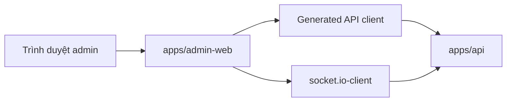

# 06. Kiến Trúc Admin Web

## Mục Đích

Mô tả kiến trúc của `apps/admin-web` như một công cụ vận hành nội bộ đủ mạnh để quan sát, điều tra và thực hiện một số thao tác có kiểm soát đối với delivery workflow.

## Trạng Thái

Baseline đã chốt cho `CV-ready MVP-1`, có mô tả rõ những màn hình chỉ phù hợp cho phase sau.

## Vai Trò Của Admin Web

Admin web không phải sản phẩm cho end-user. Nó tồn tại để giải ba bài toán:

- quan sát trạng thái hệ thống đang chạy
- điều tra các trường hợp bất thường
- thực hiện một số mutation ops có kiểm soát khi feature đã được chốt

## Những Gì Admin Web Không Làm Trong `MVP-1`

- không là nơi tạo order thay user
- không là nơi sửa tay state machine của order
- không là nơi thay backend ra quyết định dispatch
- không chứa business logic cốt lõi ở client

## Vai Trò Và Quyền Truy Cập

### Baseline đã chốt

MVP chỉ cần một capability nội bộ ở mức ứng dụng:

- `ADMIN_OPS`

### Ma trận quyền tối thiểu

| Khu vực | Quyền đọc | Quyền ghi |
| --- | --- | --- |
| Orders board | Có | Không |
| Order detail | Có | Không |
| Driver board | Có ở phase sau | Không |
| Dispatch attempts | Có ở phase sau | Không |
| Chat transcript | Có ở phase chat | Không |
| Driver applications | Có ở phase onboarding | Có |

## Mục Tiêu Ops UX

Admin web phải giúp người vận hành trả lời nhanh:

- order này đang ở trạng thái nào
- đã offer cho driver nào
- ai đã accept
- tại sao order bị kẹt hoặc thất bại
- account/driver/application hiện có capability và status gì

## Kiến Trúc Mức Cao

- dùng Next.js App Router
- tổ chức shell bằng route groups
- dữ liệu động ưu tiên fetch ở client qua generated API client
- realtime dùng để invalidate hoặc refresh nhanh, không thay HTTP source of truth



## Ghi Chú Deploy Quan Trọng

Nếu admin web được deploy dưới cùng domain với API theo subpath `/admin`, cấu hình build của Next.js phải phản ánh `basePath` tương ứng. Đây là quyết định build-time, không phải việc reverse proxy có thể “chữa” sau đó.

## Routing Đề Xuất

```text
app/
  (auth)/
    login/
      page.tsx
  (dashboard)/
    orders/
      page.tsx
      [orderId]/
        page.tsx
    drivers/
      page.tsx
    dispatch-attempts/
      page.tsx
    driver-applications/
      page.tsx
      [applicationId]/
        page.tsx
```

## Feature Boundaries

```text
src/
  app/
  features/
    orders/
      api/
      components/
      hooks/
      table/
      schemas/
    dispatch/
    drivers/
    driver-applications/
    chat/
  lib/
    api/
    auth/
    realtime/
    query/
  ui/
```

Quy tắc:

- `app/` không ôm business logic
- `features/*` chịu trách nhiệm cho route-specific UI, query orchestration và view-model mapping
- `lib/*` chứa runtime helpers dùng nhiều nơi

## Data Fetching Và Realtime

### Baseline

- React Query là server-state layer
- generated client là đường gọi HTTP chính thức
- socket event chủ yếu để invalidate hoặc refetch query

### Chiến lược refresh

- board có thể dùng polling nhẹ hoặc socket-triggered refetch
- detail page phải refetch khi có event ảnh hưởng tới order hiện tại
- mutation review hồ sơ xong phải refetch detail và list liên quan

## Order Board

### Mục tiêu

- nhìn được backlog orders
- lọc theo trạng thái
- click vào detail để điều tra

### Tối thiểu phải có

- order code
- trạng thái hiện tại
- created/requested time
- assigned driver summary nếu có
- nhãn `NO_DRIVER_FOUND` hoặc equivalent nếu dispatch cạn

## Order Detail Là Màn Hình Điều Tra Chính

### Các khối thông tin nên có

- `summary`
- `status timeline`
- `assignment summary`
- `dispatch attempts`
- `chat transcript` khi feature chat được bật

### Vì sao quan trọng

- đây là nơi nối nhiều domain nhất: orders, dispatch, drivers, chat
- nếu màn hình này nghèo dữ liệu, admin không thể debug flow thật

## Admin Ops Playbook Cấp Màn Hình

### Stuck search / no driver found

Admin cần nhìn thấy:

- order current status
- số dispatch attempts
- candidate exhaustion outcome
- thời điểm state đổi gần nhất

### Accept conflict

Admin cần nhìn thấy:

- driver thắng assignment
- driver thua race
- thời điểm conflict xảy ra

### Driver application review

Admin cần nhìn thấy:

- current application status
- submitted data
- previous review note
- action approve / reject / needs update

## Auth Và Session Model

- admin web dùng cùng backend auth domain
- UI guard và API guard đều phải kiểm tra capability admin
- token hợp lệ nhưng thiếu capability vẫn không vào dashboard

## Error, Empty Và Recovery States

Admin web không được giả định dữ liệu luôn đầy đủ.

Tối thiểu phải xử lý:

- token hết hạn
- backend tạm không sẵn sàng
- board chưa có dữ liệu
- order không tồn tại
- application không tồn tại
- socket reconnect và data stale

## Testing Strategy Cho Admin

### Unit/component

- filters
- tables
- empty/error states
- guard behavior
- query invalidation logic

### E2E

Admin web cần E2E vì Next App Router và async pages khó được chứng minh chỉ bằng unit tests.

Baseline tool:

- `@playwright/test`

Flow tối thiểu:

- login
- vào order board
- mở order detail
- thấy detail đổi sau mutation hoặc status update

## Ranh Giới Với Backend

Admin web chỉ là lớp hiển thị và thao tác ops có kiểm soát.

Không được đặt ở admin web:

- order state machine
- dispatch decision logic
- driver capability rule
- pricing policy

## Kết Luận

Admin web của dự án này phải là công cụ điều tra và vận hành thật, không phải dashboard trang trí. Nếu route structure, data flow, realtime invalidation và playbook màn hình không rõ, phần admin sẽ rất dễ biến thành nơi “vá lỗi sản phẩm” thay cho backend.
