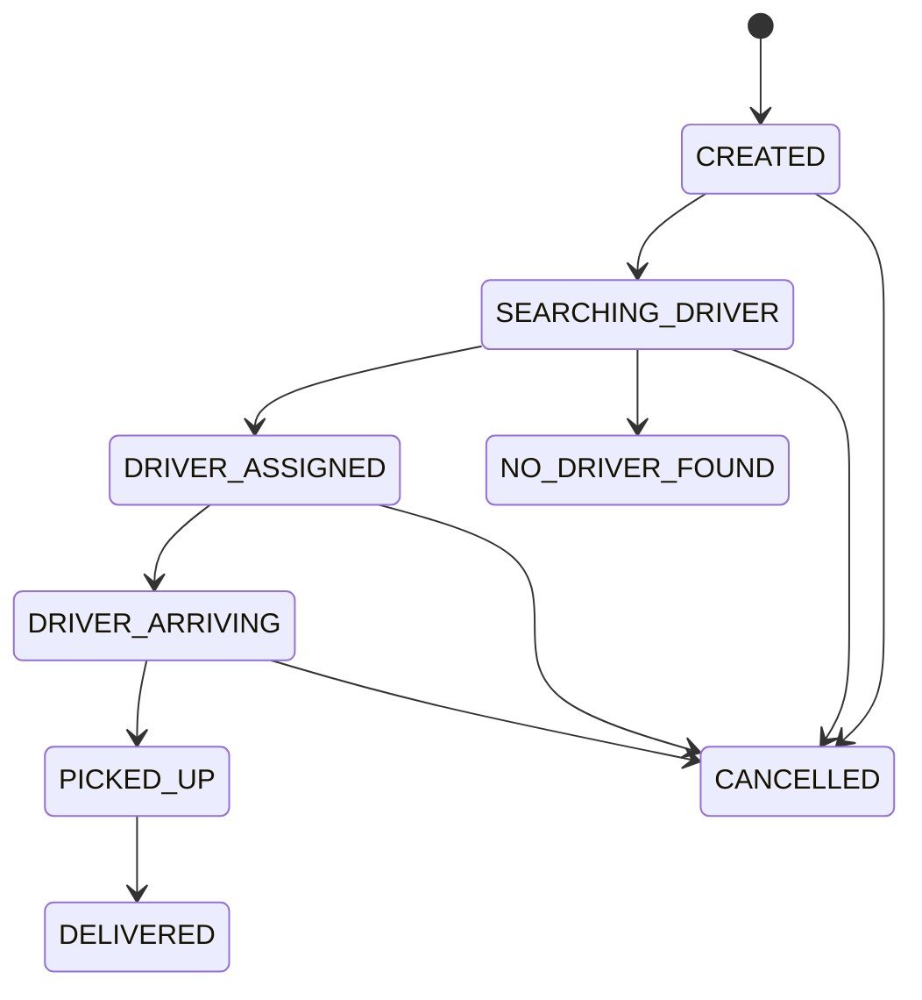
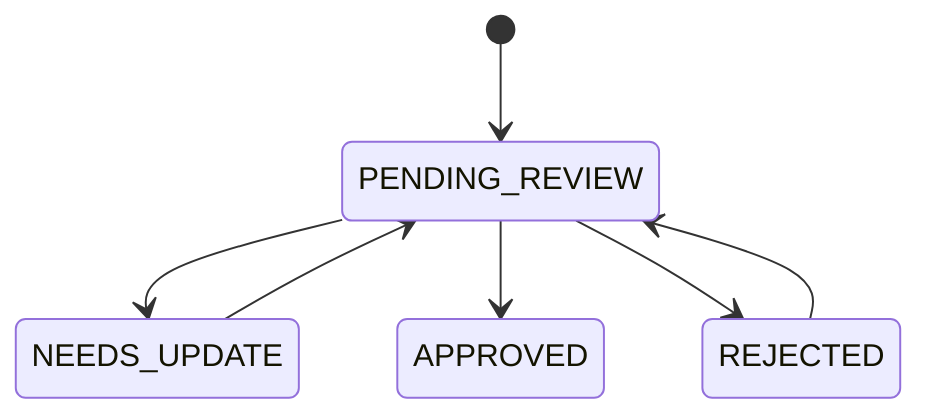

# 07. Mô Hình Dữ Liệu

## Mục Đích

Xác định mô hình dữ liệu cho delivery domain theo hướng phù hợp với nghiệp vụ, phù hợp với Prisma v7, đồng thời vẫn hỗ trợ tốt cho truy vấn địa lý bằng PostGIS.

## Trạng Thái

Baseline đã chốt cho `CV-ready MVP-1`, có chừa chỗ cho chat, driver onboarding và worker phase sau.

## Nguyên Tắc Thiết Kế

- mô hình hóa theo nghiệp vụ thật trước, không mô hình theo UI
- tách rõ state hiện tại và lịch sử thay đổi
- capability không được dựa vào `role đơn`
- quote/pricing phải có source of truth rõ ràng
- PostgreSQL là business source of truth
- Redis không thay thế dữ liệu nghiệp vụ

## Các Thực Thể Nghiệp Vụ

- account
- auth identity
- auth session
- driver application
- driver profile
- driver presence current
- pricing rule version
- quote
- order
- order stop
- order status history
- order assignment
- dispatch attempt
- chat session
- chat session participant
- chat message
- audit event
- request idempotency key

## Prisma + PostGIS Strategy

Hướng đề xuất:

- lưu `latitude` và `longitude` ở mức business data
- chuẩn hóa spatial point theo `SRID 4326`
- ưu tiên generated spatial columns hoặc query helper rõ ràng thay vì lặp lại `ST_MakePoint` tự do khắp codebase
- index geo query bằng chiến lược phù hợp với `ST_DWithin` và KNN `<->`
- bật extension `postgis` trong migration
- dùng raw SQL có parameter cho proximity query và distance filter
- Prisma Client vẫn là baseline cho phần lớn CRUD, transaction và relation traversal

## Enums Và Semantics Bắt Buộc

### `account.status`

- `ACTIVE`
- `SUSPENDED`
- `DISABLED`

### `driver_application.status`

- `PENDING_REVIEW`
- `NEEDS_UPDATE`
- `APPROVED`
- `REJECTED`

### `driver_profile.driver_status`

- `ACTIVE`
- `SUSPENDED`
- `DEACTIVATED`

### `driver_presence_current.presence_status`

- `OFFLINE`
- `AVAILABLE`
- `BUSY`
- `UNAVAILABLE`

### `orders.status`

- `CREATED`
- `SEARCHING_DRIVER`
- `NO_DRIVER_FOUND`
- `DRIVER_ASSIGNED`
- `DRIVER_ARRIVING`
- `PICKED_UP`
- `DELIVERED`
- `CANCELLED`

### `dispatch_attempts.offer_status`

- `OFFERED`
- `ACCEPTED`
- `DECLINED`
- `EXPIRED`
- `CONFLICT_LOST`
- `SKIPPED`

### `order_assignments.assignment_source`

- `DISPATCH`
- `ADMIN_MANUAL` nếu phase sau thật sự có manual ops

### `order_status_history.change_source`

- `SYSTEM`
- `USER`
- `DRIVER`
- `ADMIN`

## State Diagram Cho Order Lifecycle

## State Diagram Cho Driver Application

## Các Bảng Chính

## 1. `accounts`

Mục đích:

- thực thể danh tính chuẩn của hệ thống

Trường chính:

- `id`
- `display_name`
- `phone_e164`
- `status`
- `is_admin`
- `default_mode`
- `created_at`
- `updated_at`

Lưu ý:

- account active mặc định có capability user
- `driver capability` được suy ra từ `driver_profiles`
- `admin capability` đến từ `is_admin` hoặc cơ chế tương đương

## 2. `auth_identities`

Mục đích:

- ánh xạ account với provider đăng nhập

Trường chính:

- `id`
- `account_id`
- `provider`
- `provider_subject`
- `is_test_identity`
- `created_at`

## 3. `auth_sessions`

Mục đích:

- quản lý refresh token và session lifecycle

Trường chính:

- `id`
- `account_id`
- `refresh_token_hash`
- `device_label`
- `issued_at`
- `expires_at`
- `last_used_at`
- `revoked_at`

## 4. `driver_applications`

Mục đích:

- lưu hồ sơ đăng ký trở thành tài xế

Trường chính:

- `id`
- `account_id`
- `vehicle_type`
- `plate_number`
- `status`
- `submitted_at`
- `reviewed_at`
- `reviewed_by_admin_id`
- `review_note`
- `created_at`
- `updated_at`

## 5. `driver_profiles`

Mục đích:

- dữ liệu vận hành riêng của tài xế sau khi được duyệt

Trường chính:

- `id`
- `account_id`
- `vehicle_type`
- `plate_number`
- `driver_status`
- `approved_at`
- `suspended_at`
- `created_at`
- `updated_at`

## 6. `driver_presence_current`

Mục đích:

- trạng thái online/offline, availability và vị trí hiện tại của tài xế

Trường chính:

- `driver_id`
- `presence_status`
- `latitude`
- `longitude`
- `location_accuracy_meters`
- `heading_degrees`
- `speed_mps`
- `last_seen_at`
- `active_order_id`

Ghi chú:

- không phải update nào cũng đủ tốt để dùng cho dispatch ranking
- backend nên có freshness window riêng cho dispatch eligibility
- `location_accuracy_meters` và `last_seen_at` là hai field quan trọng để loại stale/low-quality presence

## 7. `pricing_rule_versions`

Mục đích:

- source of truth cho quote/pricing của `MVP-1`

Trường chính:

- `id`
- `code`
- `base_fee_minor`
- `per_km_minor`
- `distance_multiplier`
- `currency_code`
- `effective_from`
- `is_active`

## 8. `quotes`

Mục đích:

- báo giá trước khi tạo đơn

Trường chính:

- `id`
- `account_id`
- `service_type`
- `vehicle_type`
- `pickup_latitude`
- `pickup_longitude`
- `dropoff_latitude`
- `dropoff_longitude`
- `estimated_distance_meters`
- `estimated_price_minor`
- `pricing_version_id`
- `expires_at`
- `created_at`

## 9. `orders`

Mục đích:

- aggregate trung tâm của hệ thống giao hàng

Trường chính:

- `id`
- `account_id`
- `quote_id`
- `order_code`
- `status`
- `service_type`
- `vehicle_type`
- `pickup_address_text`
- `dropoff_address_text`
- `estimated_price_minor`
- `final_price_minor`
- `pricing_version_id`
- `pricing_snapshot_json`
- `requested_at`
- `accepted_at`
- `no_driver_found_at`
- `picked_up_at`
- `delivered_at`
- `cancelled_at`
- `created_at`
- `updated_at`

Ghi chú:

- `pricing_version_id` và `pricing_snapshot_json` là snapshot bất biến tại thời điểm create order
- `pickup_address_text` và `dropoff_address_text` trên `orders` là denormalized snapshot để đọc nhanh ở board/detail
- `order_stops` là cấu trúc stop canonical, kể cả khi `MVP-1` mới chỉ có `1 pickup + 1 dropoff`

## 10. `order_stops`

Mục đích:

- chuẩn hóa pickup và dropoff theo cấu trúc stop

Trường chính:

- `id`
- `order_id`
- `stop_type`
- `sequence_no`
- `address_text`
- `latitude`
- `longitude`
- `contact_name`
- `contact_phone`
- `note`

## 11. `order_status_history`

Mục đích:

- lưu timeline thay đổi trạng thái

Trường chính:

- `id`
- `order_id`
- `from_status`
- `to_status`
- `changed_by_account_id`
- `change_source`
- `note`
- `created_at`

## 12. `order_assignments`

Mục đích:

- lưu assignment đã được chấp nhận cho một order

Trường chính:

- `id`
- `order_id`
- `driver_id`
- `assigned_at`
- `accepted_at`
- `assignment_source`
- `created_at`

## 13. `dispatch_attempts`

Mục đích:

- lưu từng lần hệ thống thử dispatch đến tài xế

Trường chính:

- `id`
- `order_id`
- `driver_id`
- `batch_no`
- `attempt_no`
- `offer_status`
- `ranking_score`
- `offered_at`
- `offer_expires_at`
- `responded_at`
- `response_reason`

Ghi chú:

- `ranking_score` không phải API contract public; đây là field debug/audit để giải thích vì sao một candidate được offer trước
- `response_reason` cần đủ rõ để phân biệt timeout, decline, stale presence và conflict

## 14. `chat_sessions`

Mục đích:

- một chat container cho mỗi order

Trường chính:

- `id`
- `order_id`
- `status`
- `created_at`

## 15. `chat_session_participants`

Mục đích:

- lưu thành viên của chat session và read state

Trường chính:

- `id`
- `chat_session_id`
- `account_id`
- `participant_type`
- `joined_at`
- `last_read_message_id`
- `last_read_at`

## 16. `chat_messages`

Mục đích:

- lưu transcript chat và system message

Trường chính:

- `id`
- `chat_session_id`
- `sender_account_id`
- `client_message_id`
- `message_type`
- `content_text`
- `created_at`

## 17. `audit_events`

Mục đích:

- lưu audit event tổng quát cho các action quan trọng

Trường chính:

- `id`
- `aggregate_type`
- `aggregate_id`
- `actor_account_id`
- `action`
- `payload_json`
- `created_at`

## 18. `request_idempotency_keys`

Mục đích:

- lưu trạng thái `Idempotency-Key` cho các endpoint ghi có rủi ro cao như `POST /orders`

Trường chính:

- `id`
- `account_id`
- `scope`
- `idempotency_key`
- `request_hash`
- `resource_type`
- `resource_id`
- `response_status_code`
- `response_body_json`
- `created_at`
- `expires_at`

## Invariants Quan Trọng

- một `driver_profile` active trên mỗi account
- một `driver_application` active tại một thời điểm trên mỗi account
- một `driver_presence_current` trên mỗi driver
- một `chat_session` trên mỗi order
- một assignment current trên mỗi order
- một `request_idempotency_keys(scope, account_id, idempotency_key)` còn hiệu lực chỉ ánh xạ tới một outcome
- `DELIVERED` và `CANCELLED` không được quay lại trạng thái active
- `NO_DRIVER_FOUND` chỉ xuất hiện sau khi dispatch exhaustion đã được ghi nhận

## Constraint Và Index Quan Trọng

- `auth_sessions(account_id, revoked_at)`
- partial unique logic cho `driver_applications` active per account
- unique `driver_profiles(account_id)`
- unique `driver_presence_current(driver_id)`
- unique `pricing_rule_versions(code)`
- `orders(account_id, created_at desc)`
- unique current assignment cho `order_assignments(order_id)`
- `dispatch_attempts(order_id, batch_no, attempt_no)`
- unique `chat_sessions(order_id)`
- unique composite cho `chat_messages(chat_session_id, sender_account_id, client_message_id)` khi `client_message_id` có mặt
- unique `request_idempotency_keys(scope, account_id, idempotency_key)`

## Transaction Boundaries Quan Trọng

- issue session + refresh token rotation
- submit driver application
- admin review application + create/activate driver profile
- create order + initial status history + initial dispatch scheduling
- accept assignment + update order status + close competing attempts
- persist chat message + emit realtime event

## Data Semantics Cần Giữ Nhất Quán

- `estimated_price_minor` là snapshot từ quote
- `final_price_minor` chỉ thay đổi nếu có rule phase sau
- `active_order_id` trong presence là helper vận hành, không thay thế assignment source of truth
- `response_reason` trong dispatch attempt phải đủ để phân biệt `declined`, `expired`, `stale_presence`, `conflict_lost`

## Kết Luận

Mô hình dữ liệu của dự án phải đủ chặt để phục vụ `MVP-1` ngay, đồng thời không chặn đường nâng cấp về onboarding, chat và worker runtime. Ba vùng tuyệt đối không được mơ hồ là `capability model`, `pricing_rule_versions` và `dispatch/order invariants`.
