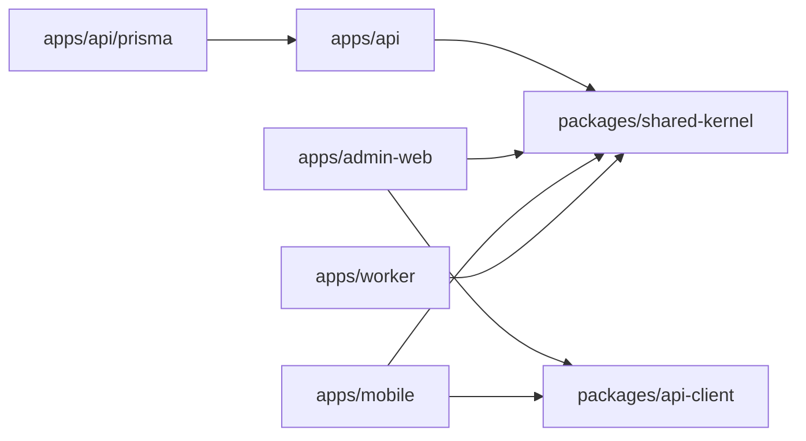

# 12. Cấu Trúc Thư Mục

## Mục Đích

Xác định cấu trúc monorepo đủ rõ để có thể scaffold thật bằng `Nx`, giữ boundary giữa các app và package, và tạo nền cho AI-agent phát triển theo feature mà không phá kiến trúc.

## Trạng Thái

Baseline đã chốt cho `CV-ready MVP-1`, có chừa chỗ cho `worker`, `tools/` và hardening ở phase sau.

## Quyết Định Cốt Lõi

- monorepo dùng package-manager workspace + `Nx`
- `apps/` chứa deployable runtimes
- `packages/` chứa code dùng chung thật sự
- `tools/` chứa generator, conformance helper hoặc workspace-specific tooling khi cần
- ưu tiên `Nx inferred tasks`; chỉ thêm `project.json` khi cần target tùy biến rõ ràng
- mọi project phải có tags từ sớm để boundary có thể enforce được

## Vì Sao Dùng Nx

`Nx` phù hợp repo này hơn `Turborepo` vì repo không chỉ cần cache script nhanh, mà còn cần:

- `Project Graph` để nhìn dependency thật
- `Task Graph` và `affected` execution cho CI
- first-party plugins cho `Nest`, `Next.js`, `Expo`
- tags và module-boundary rules
- target contracts rõ để AI-agent có cách chạy và verify thống nhất

Không giả định `Nx Cloud` ở `MVP-1`.

## Root Files Phải Có

```text
package.json
nx.json
tsconfig.base.json
<workspace-manifest của package manager>
apps/
packages/
tools/
infra/
docs/
```

Ghi chú:

- `workspace-manifest` phụ thuộc package manager được chọn lúc scaffold
- `nx.json` là nơi chốt `targetDefaults`, `namedInputs`, plugins và cache policy
- `tsconfig.base.json` là nguồn alias và TS path dùng chung cho workspace

## Bố Cục Monorepo

```text
apps/
  api/
  admin-web/
  mobile/
  worker/
packages/
  api-client/
  shared-kernel/
tools/
infra/
docs/
nx.json
tsconfig.base.json
```

## Sơ Đồ Phụ Thuộc Mức Cao



## Quy Ước Đặt Tên Project Trong Nx

Khuyến nghị:

- `api`
- `admin-web`
- `mobile`
- `worker`
- `api-client`
- `shared-kernel`

Không cần prefix quá dài nếu repo không có hàng chục app cùng loại.

## Hệ Tags Bắt Buộc

### 1. `scope:*`

- `scope:api`
- `scope:admin`
- `scope:mobile`
- `scope:shared`
- `scope:infra`

### 2. `type:*`

- `type:app`
- `type:feature`
- `type:data-access`
- `type:ui`
- `type:util`
- `type:tooling`

### 3. `platform:*`

- `platform:server`
- `platform:web`
- `platform:mobile`
- `platform:shared`

## Boundary Rules Cần Enforce

- `scope:admin` và `scope:mobile` không được import source code từ `scope:api`
- `scope:api` không được import source code từ `scope:admin` hoặc `scope:mobile`
- `type:ui` không được phụ thuộc vào `type:data-access`
- code chung chỉ được chuyển vào `packages/` nếu thật sự được dùng từ hai nơi trở lên và không mang runtime riêng
- generated client HTTP chỉ đi qua `packages/api-client`

## Hợp Đồng Target Trong Nx

Mỗi project quan trọng nên có:

- `lint`
- `typecheck`
- `test`
- `build`

Theo điều kiện:

- `serve`
- `dev`
- `start`
- `e2e`
- `smoke`
- `contract`
- `android`
- `ios`

## Root Structure Chi Tiết

Phần này mô tả target scaffold state của workspace sau khi execution baseline hoàn tất, không phải cam kết rằng repo hiện tại đã có đầy đủ tree đó ngay hôm nay.

```text
apps/
  api/
    src/
    test/
    prisma/
    prisma.config.ts
    project.json
  admin-web/
    src/
    public/
    project.json
  mobile/
    app/
    src/
    assets/
    project.json
  worker/
    src/
    test/
    project.json
packages/
  api-client/
    src/
    generated/
    project.json
  shared-kernel/
    src/
    project.json
tools/
  generators/
  conformance/
infra/
  compose/
  caddy/
  scripts/
docs/
```

## `apps/api`

### Mục đích

Chứa NestJS backend chính thức của hệ thống.

### Cấu trúc đề xuất

```text
apps/api/
  prisma.config.ts
  prisma/
    schema.prisma
    migrations/
    seeds/
      seed.ts
    sql/
      postgis/
      read-models/
      views/
  src/
    main.ts
    app.module.ts
    bootstrap/
    config/
    common/
    prisma/
    modules/
      auth/
        presentation/
        application/
        domain/
        infrastructure/
      orders/
        presentation/
        application/
        domain/
        infrastructure/
      dispatch/
        presentation/
        application/
        domain/
        infrastructure/
      drivers/
      quotes/
      admin/
      health/
  test/
    integration/
    e2e/
```

### Quy tắc

- `apps/api/prisma/` và `apps/api/prisma.config.ts` là ownership hiện tại của Prisma CLI assets
- `src/prisma/` là runtime integration layer cho NestJS, không phải nơi chứa schema và migration
- `presentation` chứa controller, gateway, DTO
- `application` chứa use-case/service orchestration
- `domain` chứa policy, state machine, invariant, domain service thuần
- `infrastructure` chứa repository, query service, mapper, provider adapter
- chỉ tách Prisma sang `packages/database` khi có ít nhất một server-side consumer thứ hai thật sự cần dùng chung schema, migrations hoặc generated client

## `apps/admin-web`

### Mục đích

Dashboard vận hành nội bộ.

### Cấu trúc đề xuất

```text
apps/admin-web/
  src/
    app/
      (auth)/
      (dashboard)/
        orders/
        drivers/
        dispatch-attempts/
        driver-applications/
    features/
      orders/
        api/
        components/
        hooks/
        schemas/
        table/
      drivers/
      dispatch/
      driver-applications/
    lib/
      api/
      auth/
      realtime/
      query/
    ui/
    styles/
  public/
```

### Quy tắc

- route files không ôm business logic
- feature folders chịu trách nhiệm compose UI, query state và client-side behavior
- nếu một helper chỉ thuộc admin web thì không được chuyển vội sang `packages/`

## `apps/mobile`

### Mục đích

Ứng dụng Expo duy nhất cho `user mode` và `driver mode`.

### Cấu trúc đề xuất

```text
apps/mobile/
  app/
    _layout.tsx
    (auth)/
    (user-tabs)/
    driver/
      apply.tsx
      review-status.tsx
    (driver-tabs)/
    order/
      [orderId]/
        index.tsx
        chat.tsx
  src/
    features/
      auth/
        api/
        hooks/
        screens/
        schemas/
      quotes/
      orders/
      dispatch/
      driver-onboarding/
      driver-ops/
      chat/
      maps/
    lib/
      api/
      auth/
      realtime/
      storage/
      forms/
      permissions/
    stores/
    ui/
    components/
    hooks/
    constants/
```

### Quy tắc

- `app/` chỉ giữ route tree và layout composition
- business logic client nằm ở `src/features/*` và `src/lib/*`
- store toàn cục chỉ dùng cho session, mode switch và UI state; không thay React Query cho server state

## `apps/worker`

### Mục đích

Xử lý background jobs khi async runtime được tách riêng.

### Ghi chú

- không phải blocker của `MVP-1`
- scaffold khi dispatch core đã ổn định
- giữ shared code qua `packages/`, không copy từ `apps/api`

## `packages/api-client`

### Mục đích

Đóng gói generated client từ OpenAPI cho admin và mobile.

### Cấu trúc đề xuất

```text
packages/api-client/
  src/
    index.ts
    config.ts
    runtime/
  generated/
    client.gen.ts
    sdk.gen.ts
    types.gen.ts
    schemas.gen.ts
    tanstack-query.gen.ts
  openapi-ts.config.ts
```

### Quy tắc

- không sửa trực tiếp file generated
- runtime wrappers đặt ngoài `generated/`
- artifacts trong `generated/` phụ thuộc plugin đã bật

## `packages/shared-kernel`

### Mục đích

Chứa các kiểu dữ liệu, constants và helpers trung lập, ổn định, dùng chung thật sự.

### Chỉ nên chứa

- enums hoặc constants trung lập
- shared value objects không kéo theo framework runtime
- utility nhỏ và ổn định

### Không nên chứa

- business logic riêng của `api`
- hooks hoặc UI components đặc thù web/mobile
- Prisma models hoặc server-only types

## `tools/`

### Mục đích

Chứa tooling đặc thù workspace khi repo đủ lớn để cần:

- local generators
- code mods
- conformance helpers
- custom lint/boundary tooling

### Quy tắc

- `tools/` chỉ thêm khi có use case rõ
- không dựng tooling tùy biến sớm nếu Nx plugins sẵn có đã đủ

## `apps/api/prisma` và `apps/api/prisma.config.ts`

### Mục đích

Nguồn sự thật cho schema dữ liệu, migration, seed và SQL chuyên biệt.

### Cấu trúc đề xuất

```text
apps/api/
  prisma.config.ts
  prisma/
  schema.prisma
  migrations/
  seeds/
    seed.ts
  sql/
    postgis/
    read-models/
    views/
```

### Ghi chú

- Prisma v7 là config-first, nhưng `prisma.config.ts` chỉ cần nằm ở root của package sở hữu Prisma setup; với repo này đó là `apps/api`
- path trong `prisma.config.ts` được resolve theo vị trí file config, nên đặt config cạnh `apps/api/prisma/` giúp ownership rõ và CLI ít mơ hồ hơn trong monorepo
- `worker` phase sau không nên phụ thuộc trực tiếp vào Prisma assets của `api`; nếu về sau có consumer server-side thứ hai thật sự, lúc đó mới trích xuất sang `packages/database`

## `infra/`

### Mục đích

Chứa tài nguyên vận hành.

### Cấu trúc đề xuất

```text
infra/
  compose/
    compose.yaml
    compose.override.yaml
    compose.prod.yaml
  caddy/
    Caddyfile
  scripts/
  backups/
```

## Quy Tắc Import Và Ownership

- `api` và `worker` không import source từ `admin-web` hoặc `mobile`
- `admin-web` và `mobile` không import source backend
- HTTP typed contract chỉ đi qua `packages/api-client`
- shared code mới chỉ được tách ra `packages/` khi ranh giới runtime và ownership còn rõ sau khi tách
- khi một feature chỉ thuộc một app, giữ nó ở app đó

## Những Mùi Kiến Trúc Cần Tránh

- đẩy mọi thứ vào `packages/` quá sớm
- để `app/` route files chứa business logic
- để `ui/` import trực tiếp data-access
- để admin/mobile dùng chung “shared feature” nhưng thật ra khác context nghiệp vụ
- để `worker` copy/paste logic từ `api` thay vì đi qua package hoặc module rút gọn

## Kết Luận

Cấu trúc thư mục của repo phải phục vụ trực tiếp cho việc scaffold và điều phối agent. Điểm quan trọng nhất không phải “đẹp mắt”, mà là ranh giới đủ chặt để `Nx graph`, `affected`, testing và phase planning đều phản ánh đúng kiến trúc thật.
