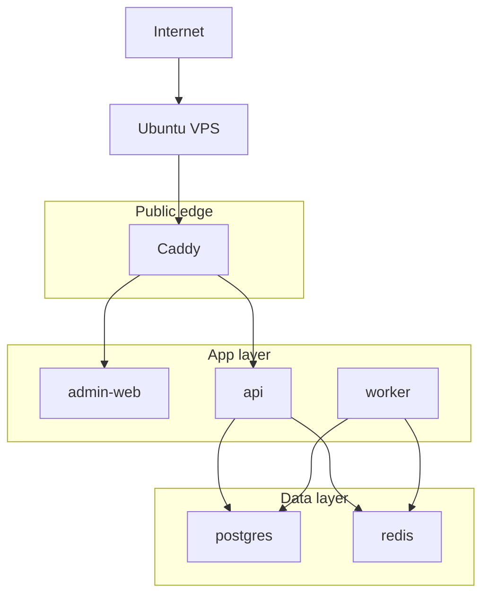

# 13. Hạ Tầng Tự Triển Khai

## Mục Đích

Phân tích các lựa chọn hạ tầng phù hợp với dự án và chốt phương án self-host khi thật sự cần public hosted demo.

## Trạng Thái

`Local-first` là baseline của `CV-ready MVP-1`. Self-host trên một VPS là phương án đã chấp thuận cho giai đoạn public demo, không phải điều kiện bắt buộc từ ngày đầu.

## Ràng Buộc

- chi phí thấp
- dễ vận hành bởi một người
- đủ thực tế để demo
- hỗ trợ API, admin web, mobile clients và worker khi cần

## Các Lựa Chọn Đã Xem Xét

### Phương án A: chỉ chạy local

Ưu điểm:

- rẻ nhất
- đơn giản nhất
- phù hợp nhất cho giai đoạn build đầu tiên

Nhược điểm:

- khó demo công khai

### Phương án B: một VPS với Docker Compose

Ưu điểm:

- chi phí thấp
- dễ hiểu
- đủ thực tế cho public demo

Nhược điểm:

- single point of failure
- scale chủ yếu theo chiều dọc

### Phương án C: ghép nhiều PaaS managed service

Ưu điểm:

- giảm việc vận hành

Nhược điểm:

- chi phí tăng sớm
- phân mảnh kiến trúc

### Phương án D: Kubernetes

Ưu điểm:

- mạnh về lâu dài

Nhược điểm:

- quá lớn cho phạm vi hiện tại

## Phương Án Được Chọn Theo Giai Đoạn

### `CV-ready MVP-1`

- chọn `Phương án A: local-first`

### Public demo

- chọn `Phương án B: một VPS với Docker Compose`

## Topology Cấp Cao Cho Public Demo

## Public Routing

- `https://example.com/admin`
- `https://example.com/api`
- `wss://example.com/api/socket.io`

Ghi chú:

- nếu admin web đi qua `/admin`, build của Next.js phải phản ánh `basePath`
- khi chạy trong Docker, reverse proxy phải trỏ tới service name/container name, không trỏ `localhost`
- nếu subpath routing làm tăng footgun quá mức trong giai đoạn demo, subdomain tách riêng là fallback hợp lệ và thường dễ vận hành hơn

## Vì Sao Dùng Caddy

- cấu hình gọn
- HTTPS tự động
- phù hợp với scope hiện tại
- dễ vận hành hơn Nginx trong bối cảnh này

## Vai Trò Của Từng Service

### Caddy

- terminate HTTPS
- route `/admin` và `/api`
- xử lý websocket upgrade

### API

- REST API
- auth
- OpenAPI
- Socket.IO
- order, dispatch và chat orchestration

### Worker

- chỉ bật khi async runtime thật sự cần
- BullMQ consumer
- retry hoặc delayed jobs

### PostgreSQL

- source of truth

### Redis

- queue backend hoặc transient runtime support
- trong baseline local-first, Redis bật qua compose profile riêng thay vì bật mặc định

## Ownership Boundary (Infra vs App Runtime)

| Nhóm | Infra ownership | App-level ownership |
| --- | --- | --- |
| Data services | service/container definitions cho PostgreSQL/PostGIS/Redis, network, volumes | connection string và runtime toggles tại `apps/*` env files |
| Secrets | secret file placement, file permissions, injection path | giá trị secret cụ thể theo app hoặc môi trường |
| Runtime policy | deployment topology, public/private exposure | business behavior flags và feature-level config |

Rule:

- infra artifacts không phải nơi chứa business rules
- app runtime config không được ghi đè topology contract đã chốt ở infra layer

### Secrets handling theo context

- local: dùng sample/env template cho onboarding; secret thật giữ ở local env hoặc secret file ngoài git
- CI: dùng encrypted secrets của GitHub Actions và mapping tối thiểu theo principle of least privilege
- self-host: secret file placement do infra ownership quản lý; app owners chỉ cung cấp runtime values cần thiết

Không được:

- in secret values ra logs/terminal output khi verify
- commit env file chứa secret thật vào repo

## Scaling Strategy

### Giai đoạn đầu

- scale dọc trên một máy local hoặc một VPS
- chưa cần multi-node

### Khi cần mở rộng

- tách database ra managed service hoặc máy riêng
- scale API container nếu thật sự cần
- tách worker theo queue type

## Bảo Mật

- chỉ Caddy public
- PostgreSQL và Redis nằm trong private Docker network
- dùng secret qua environment variables hoặc secret file
- throttle các endpoint nhạy cảm

## Tối Thiểu Phải Có Trước Khi Public Demo

- SSH key-only login và tắt password login nếu có thể
- firewall chỉ mở `80/443` và cổng SSH quản trị
- volume layout rõ cho database, logs và backups
- secret files hoặc env files phải có ownership và quyền truy cập rõ

## Chiến Lược Artifact Và Deploy

- ưu tiên một artifact path nhất quán: source checkout + `docker compose up -d --build` hoặc image pull từ registry
- không nên trộn nhiều cách deploy trong cùng giai đoạn demo
- phải có rollback path tối thiểu về artifact hoặc commit trước đó

## Sao Lưu Và Khôi Phục

- chốt cadence backup trước khi public demo
- backup phải nằm ngoài container lifecycle
- restore drill phải được chạy ít nhất một lần trước khi coi hosted demo là đáng tin

Deterministic drill baseline:

- `bun run db:migrate`
- `bun run db:seed`
- `bun run db:smoke`
- `bun run db:reset`

## Kết Luận

Tài liệu hạ tầng của dự án phải phản ánh đúng thực tế: `CV-ready MVP-1` không cần public VPS để chứng minh giá trị kỹ thuật. Một VPS với Docker Compose và Caddy vẫn là đường public demo hợp lý, nhưng nó là bước sau khi core flow đã đứng vững.
