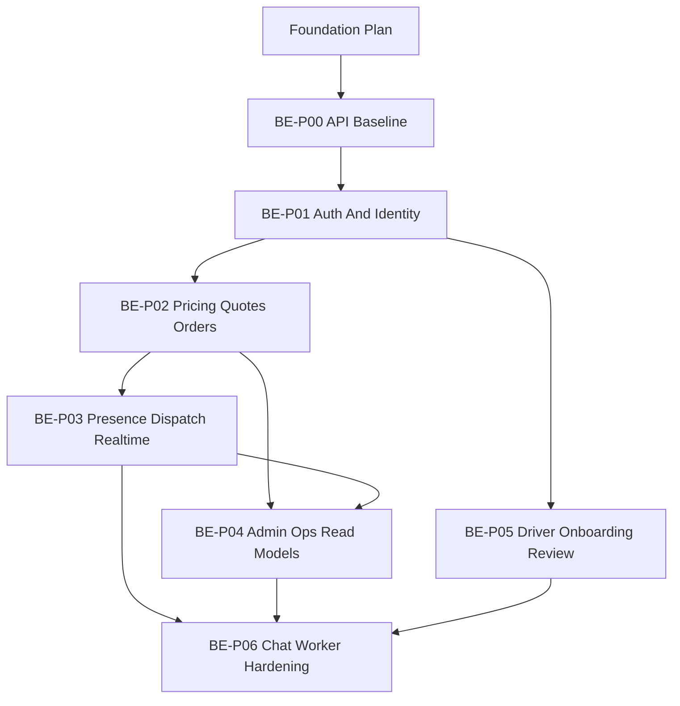

# Backend Roadmap Và Phase DAG

## Roadmap

Điểm bắt đầu của roadmap này là sau khi `Foundation Plan (path hiện tại: docs/plan/foundation/)` đã đạt acceptance gate cho workspace bootstrap, local infra, app shells, và verification baseline dùng chung.

<!-- mark-phase: BE-P00 -->
### BE-P00 API Baseline Adaptation Sau Foundation

Outcome:
- `apps/api` được map vào workspace conventions đã có sẵn
- có architecture skeleton, Prisma baseline, OpenAPI baseline, và test harness dành riêng cho backend

<!-- mark-phase: BE-P01 -->
### BE-P01 Auth, Sessions, Accounts, Driver Identity

Outcome:
- backend-owned session flow hoạt động
- có model accounts và capability cho driver
- có hợp đồng identity cơ bản cho driver

<!-- mark-phase: BE-P02 -->
### BE-P02 Pricing, Quotes, Orders

Outcome:
- quote estimation chạy theo pricing policy đã chốt
- có order aggregate và lifecycle baseline
- HTTP contracts cho create order và order detail ổn định

<!-- mark-phase: BE-P03 -->
### BE-P03 Driver Presence, Dispatch, Realtime

Outcome:
- ingest được driver presence
- dispatch candidate search và offer flow hoạt động
- realtime event nhất quán với HTTP state

<!-- mark-phase: BE-P04 -->
### BE-P04 Admin Operations Và Read Models

Outcome:
- backend hỗ trợ read model cho order board và order investigation
- admin investigation semantics rõ ràng; admin mutations vẫn ngoài baseline `MVP-1` cho tới khi docs gốc chấp thuận

<!-- mark-phase: BE-P05 -->
### BE-P05 Driver Onboarding Và Review

Outcome:
- có flow nộp hồ sơ và review driver
- admin có thể approve hoặc reject onboarding an toàn

<!-- mark-phase: BE-P06 -->
### BE-P06 Chat, Worker Extraction, Hardening

Outcome:
- có order chat
- có thể tách các job phù hợp sang worker an toàn
- có smoke và hardening mức đủ tốt để demo

## Đồ Thị Phụ Thuộc Giữa Các Phase

## Các Quyết Định Thứ Tự Quan Trọng

- Foundation Plan phải xong trước backend roadmap vì root workspace, local infra, app shells, và verification path dùng chung không thuộc phạm vi của backend plan.
- `P00` phải xong trước mọi backend feature vì boundary, Prisma, OpenAPI, và backend test harness ảnh hưởng toàn bộ phía sau.
- `P01` phải trước `P02` vì orders cần authenticated account và capability semantics rõ ràng.
- `P02` phải trước `P03` vì dispatch làm việc trên order đã persist, status transition, và pricing context.
- `P05` được đặt sau `P03` theo product priority, dù về mặt domain thì onboarding cũng liên quan đến driver.
- `P06` để cuối vì chat và worker extraction là phần đi sau baseline dispatch và realtime.

## Quy Tắc Chia Nhỏ Task Trong Backend Plan

- mỗi task chỉ mang một thay đổi có thể verify rõ ở mức contract/schema/runtime
- không gộp nhiều bounded contexts trong một task trừ khi đó là integration gate bắt buộc
- tách rõ task docs-only với task runtime để evidence không bị mơ hồ
- ưu tiên task nhỏ theo các nhóm: schema, API contract, application logic, realtime, read-model, tests
- task nào cần migration/fixtures phải nêu dependency explicit

Heuristic cân bằng khối lượng:
- phase nào nhiều rủi ro runtime nên có task nhỏ hơn và verification dày hơn
- phase nào thiên docs/contracts thì giữ docs-only/current-state rõ ràng, không gắn runtime checks giả tạo

## Acceptance Gate Theo Phase

- `P00`:
  - `apps/api` đã có baseline map cho module structure, Prisma, OpenAPI, test harness
  - dependency từ Foundation Plan cần cho backend đã được thỏa (`FDN-P00..P02` theo task deps)
  - command matrix backend không mâu thuẫn runbook current-state/target-state
- `P01`:
  - session lifecycle đã có contract rõ cho `dev-login`, `refresh`, `logout`, `/auth/me`
  - `/auth/me` trả được capability truth model nhất quán với docs gốc
  - auth/capability unhappy paths đã có verification plan tương ứng
- `P02`:
  - quote -> order contract đã chốt fields pricing snapshot và idempotency semantics
  - lifecycle và unhappy paths tối thiểu (`QUOTE_EXPIRED`, duplicate create) đã có verification plan
- `P03`:
  - presence ingest, candidate selection, offer lifecycle, accept conflict đều có persistence semantics rõ
  - realtime events có đường HTTP reconciliation rõ, không làm lệch source of truth
- `P04`:
  - admin board/detail reads phục vụ triage và investigation, không dừng ở raw entity fetch
  - scope mutation admin vẫn được khóa theo baseline docs gốc
- `P05`:
  - onboarding submit/review có state transitions, audit trail, capability update an toàn
  - review flows đã có kế hoạch verify cho approve/reject/idempotency
- `P06`:
  - chat contracts và worker extraction plan không phá vỡ các contract phase trước
  - smoke/hardening checklist đã phủ tối thiểu health, auth, quote, order, dispatch, admin read flows

## Gate Chuyển Phase

Một phase chỉ được mở khi:
- dependencies direct của phase trước đã close với evidence hợp lệ
- quality gate của phase trước đã pass
- không còn blocker mở liên quan source docs hoặc ownership boundary
