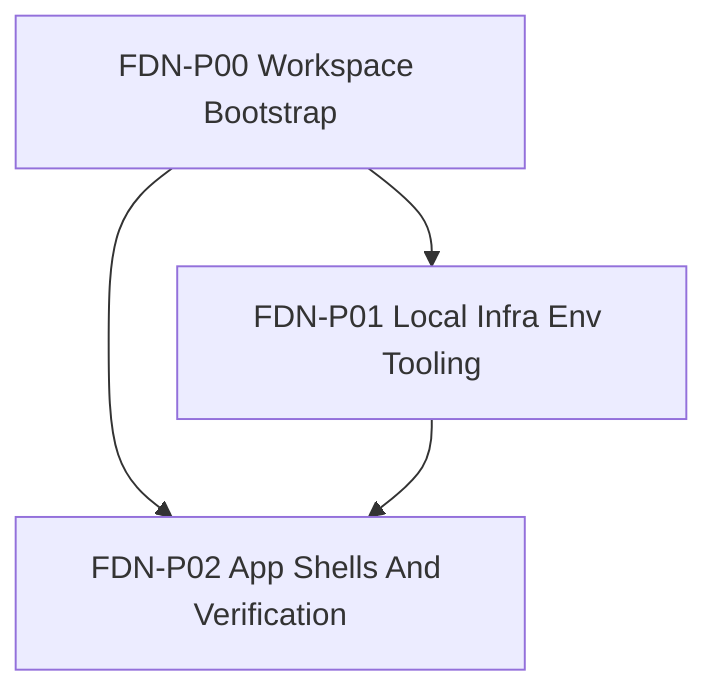

# Foundation Roadmap Và Phase DAG

## Roadmap

<!-- mark-phase: FDN-P00 -->
### FDN-P00 Workspace Bootstrap Và Governance

Outcome:
- root workspace baseline tồn tại và không còn mơ hồ về current state so với target Nx state
- có governance cho projects, targets, tags, và ownership ở cấp repo

<!-- mark-phase: FDN-P01 -->
### FDN-P01 Local Infra, Env, Và Tooling

Outcome:
- local infra baseline cho Postgres/PostGIS và optional Redis được chốt
- env layout, seed/reset flow, và secrets policy đủ rõ để các app dựa vào

<!-- mark-phase: FDN-P02 -->
### FDN-P02 App Shells, Shared Packages, Và Verification Baseline

Outcome:
- app shells cho `apps/api`, `apps/admin-web`, và `apps/mobile` được scaffold theo cùng một workspace contract
- shared package boundaries, contract path, verification baseline, và `AGENTS.md` layering đủ rõ để các app plan bắt đầu execution

## Đồ Thị Phụ Thuộc Giữa Các Phase

## Các Quyết Định Thứ Tự Quan Trọng

- `P00` phải đi trước vì root workspace, project registration, và governance là nền cho toàn repo.
- `P01` đi sau `P00` vì infra và env policy cần bám đúng workspace layout và package strategy.
- `P02` chỉ nên chốt sau `P00` và `P01` để app shells không bị scaffold trên contract còn mơ hồ.

## Acceptance Gate Theo Phase

- `P00`:
  - current-state và target-state đã có matrix đối chiếu trong plan docs
  - project registry đã liệt kê tối thiểu `apps/api`, `apps/admin-web`, `apps/mobile`, `infra/`, `tools/`
  - target conventions (targets, tags, ownership) đã được ghi rõ để phase sau không phải tự đặt lại
- `P01`:
  - local infra contract đã nêu rõ `Postgres/PostGIS` bắt buộc và `Redis` theo điều kiện
  - env layout đã có ownership rule và danh sách biến tối thiểu cho app plans dùng lại
  - migrate, seed, reset path đã được mô tả theo hướng deterministic
- `P02`:
  - app shell contract đã phủ đủ `apps/api`, `apps/admin-web`, `apps/mobile`
  - shared package boundaries và contract/codegen path đã được chốt
  - repo verification baseline đã phân biệt rõ current-state fallback và target-state `nx affected`
  - AGENTS layering cho root và local scopes đã có rule rõ để mở execution theo app
