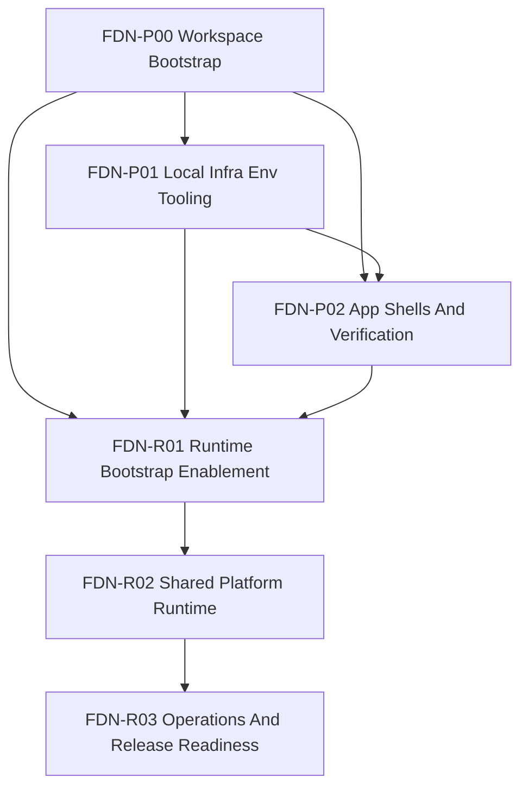

# Foundation Roadmap Và Phase DAG

## Roadmap

<!-- mark-phase: FDN-P00 -->
### FDN-P00 Workspace Bootstrap Và Governance

Outcome:
- root workspace baseline tồn tại và không còn mơ hồ về current state so với target Nx state
- có governance cho projects, targets, tags, và ownership ở cấp repo

<!-- mark-phase: FDN-P01 -->
### FDN-P01 Local Infra, Env, Và Tooling

Outcome:
- local infra baseline cho Postgres/PostGIS + compose profiles được chốt: `redis` (optional runtime), `debug` (debug tools), `jobs` (maintenance jobs)
- env layout, seed/reset flow, và secrets policy đủ rõ để các app dựa vào

<!-- mark-phase: FDN-P02 -->
### FDN-P02 App Shells, Shared Packages, Và Verification Baseline

Outcome:
- app shells cho `apps/api`, `apps/admin-web`, và `apps/mobile` được scaffold theo cùng một workspace contract
- shared package boundaries, contract path, verification baseline, và `AGENTS.md` layering đủ rõ để các app plan bắt đầu execution

<!-- mark-phase: FDN-R01 -->
### FDN-R01 Runtime Bootstrap Enablement

Outcome:
- root Nx monorepo runtime files và target-state command path chạy được thực tế
- local Docker baseline cho Postgres/PostGIS + profile `redis` (optional) có thể bootstrap lặp lại; profile `debug` và `jobs` dùng theo nhu cầu vận hành
- Husky + lint-staged trở thành pre-BE mandatory gate
- CI có thể chạy `nx affected` như target-state mặc định

<!-- mark-phase: FDN-R02 -->
### FDN-R02 Shared Platform Runtime

Outcome:
- shared packages (`api-client`, `shared-kernel`) có runtime scaffold rõ và ownership enforce được
- contract codegen pipeline dùng chung chạy được end-to-end
- `tools/` có conformance helpers để giảm drift workspace

<!-- mark-phase: FDN-R03 -->
### FDN-R03 Operations And Release Readiness

Outcome:
- CI/CD governance ổn định theo target-state với fallback có kiểm soát
- backup/restore drill + observability + security guardrails đạt mức release-ready
- release smoke contracts cho backend/admin/mobile có thể dùng như gate trước public demo

## Đồ Thị Phụ Thuộc Giữa Các Phase

## Các Quyết Định Thứ Tự Quan Trọng

- `P00` phải đi trước vì root workspace, project registration, và governance là nền cho toàn repo.
- `P01` đi sau `P00` vì infra và env policy cần bám đúng workspace layout và package strategy.
- `P02` chỉ nên chốt sau `P00` và `P01` để app shells không bị scaffold trên contract còn mơ hồ.
- `R01` phải đi sau `P00..P02` để biến docs-contract thành runtime-contract trước khi backend phases vào implementation thực thi.
- `R02` đi sau `R01` để chuẩn hóa shared-platform runtime (packages/contracts/tooling) trước khi scale feature implementation đa app.
- `R03` đi sau `R02` để khóa release-readiness (ops/backup/security/smoke) cho toàn dự án.

## Quy Tắc Chia Nhỏ Task Trong Foundation

- mỗi task chỉ mở khóa một output có thể verify
- không trộn chung workspace policy, infra contract, và tooling implementation trong một task
- task docs-only không được lẫn runtime verification
- task current-state phải nêu command/artifact hiện hữu để kiểm chứng
- nếu một task chạm quá nhiều path không liên quan, tách thành nhiều task con theo ownership

Heuristic cân bằng khối lượng:
- task chuẩn nên có thời lượng nhỏ, có thể review độc lập
- mỗi phase nên có số task tương đối cân đối theo độ phức tạp thực tế
- ưu tiên tách task theo ranh giới ownership (`workspace`, `infra`, `contracts`, `verification`)

## Acceptance Gate Theo Phase

- `P00`:
  - current-state và target-state đã có matrix đối chiếu trong plan docs
  - project registry đã liệt kê tối thiểu `apps/api`, `apps/admin-web`, `apps/mobile`, `infra/`, `tools/`
  - target conventions (targets, tags, ownership) đã được ghi rõ để phase sau không phải tự đặt lại
- `P01`:
  - local infra contract đã nêu rõ `Postgres/PostGIS` bắt buộc và compose profiles theo điều kiện: `redis` (optional), `debug` (debug tools), `jobs` (maintenance jobs)
  - env layout đã có ownership rule và danh sách biến tối thiểu cho app plans dùng lại
  - migrate, seed, reset path đã được mô tả theo hướng deterministic
- `P02`:
  - app shell contract đã phủ đủ `apps/api`, `apps/admin-web`, `apps/mobile`
  - shared package boundaries và contract/codegen path đã được chốt
  - repo verification baseline đã phân biệt rõ current-state fallback và target-state `nx affected`
  - AGENTS layering cho root và local scopes đã có rule rõ để mở execution theo app

## Cross-Layer Handoff Gate

Foundation được coi là handoff-ready cho backend khi:
- `FDN-P00..P02` không còn blocker mở ở docs layer
- `FDN-R01` không còn blocker mở ở runtime layer
- verification baseline hiện tại đã rõ current-state và target-state
- contract path và ownership boundaries đã chốt, không còn ambiguity cho app-specific plans

Foundation được coi là release-ready cho toàn project khi:
- `FDN-R02` hoàn tất shared-platform runtime gates
- `FDN-R03` hoàn tất operations/release-readiness gates
